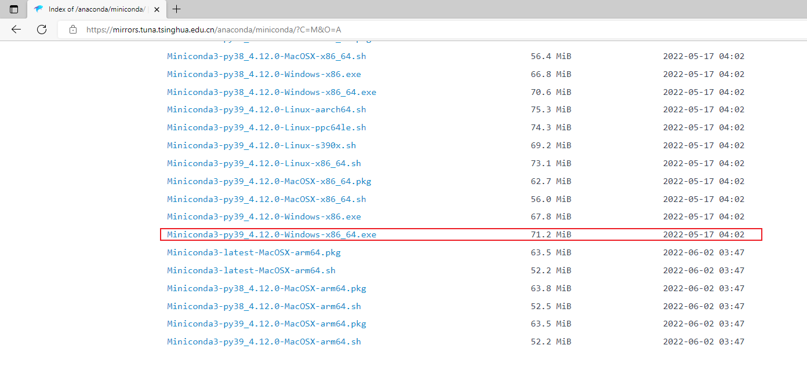
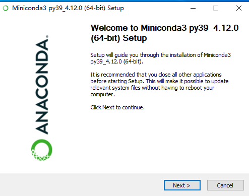
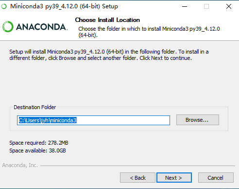
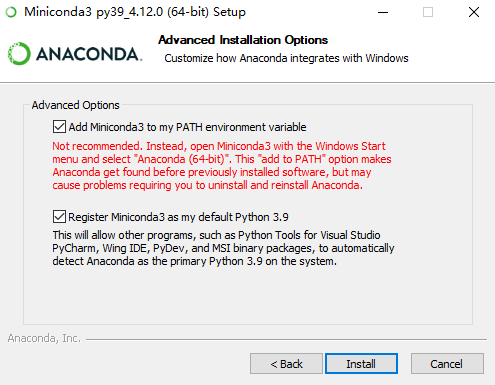

# Install Miniconda on Win10

##  一、获取Win的Miniconda安装包

### 1.官网

去官网[https://docs.conda.io/en/latest/miniconda.html](https://docs.conda.io/en/latest/miniconda.html ) 下载：


### 2.开源镜像

[https://mirrors.tuna.tsinghua.edu.cn/anaconda/miniconda/](https://links.jianshu.com/go?to=https%3A%2F%2Fmirrors.tuna.tsinghua.edu.cn%2Fanaconda%2Fminiconda%2F)




## 二、安装过程

1.运行安装包，点击Next；



2.点击 I Agree


3.点击Next；


4.选择安装路径，点击Next；



5.选择添加环境变量，点击Install；



6.点击Next；


7.安装完成。


## 三、MiniConda安装成功检验及常规命令

### 1. MiniConda安装成功检验

安装成功之后，可以调出cmd命令框（窗口键+“R”，输入“cmd”回车即可）。

输入如下命令：

```python
conda info
```

查看conda、环境相关信息。出现下图，则表示安装成功。


### 3. 在cmd命令终端，输入如下命令，即可更换Miniconda的软件源为清华源：

```
conda config --add channels https://mirrors.tuna.tsinghua.edu.cn/anaconda/pkgs/free/
conda config --add channels https://mirrors.tuna.tsinghua.edu.cn/anaconda/cloud/msys2/
conda config --add channels https://mirrors.tuna.tsinghua.edu.cn/anaconda/cloud/conda-forge 
```

至此，Miniconda的环境搭建完成，但是此时还不能进行深度学习的开发，还需要安装其他必要的工具包。


### 2. Conda管理包

```r
# 安装命令
conda install package_name
# 安装numpy,输入
conda install numpy
# 安装 matplotlib
conda install matplotlib
# 查看已安装的包
conda list
# 搜索安装包
conda search search_term
# 同时安装多个包
conda install numpy scipy pandas scikit-learn matplotlib
# 安装指定版本的包
conda install numpy=1.11
# 卸载包
conda remove package_name
# 更新包
conda update package_name
# 更新环境中的所有包
conda update --all四
```

### 3. Conda创建环境

```bash
# 基于 python3.9 创建一个名为py39 的环境
conda create --name py39 python=3.9
# 基于 python2.7 创建一个名为py27 的环境
conda create --name py27 python=2.7
# 激活 test 环境
conda activate py27  # windows

# 切换到python3
conda activate py39
```